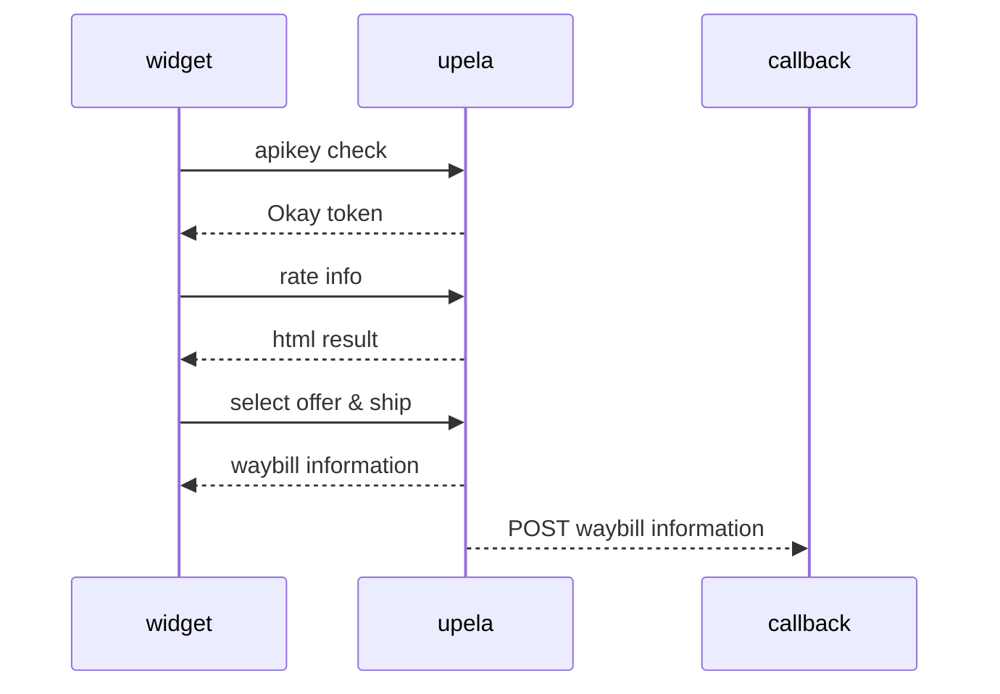

# Hello Widget 

## Introduction

This tutorial shows you how to add a simple Upela Widget with to a web page. It suits people with beginner or intermediate knowledge of HTML and CSS, and a little knowledge of JavaScript.

Below is the widget you'll create using this tutorial. 


The section below displays the entire code you need to create the map in this tutorial.


## Try it yourself

```html
<!DOCTYPE html>  
    <html>  
    <head>  
      <!--Load the API from the specified URL  
     * The async attribute allows the browser to render the page while the API loads -->  <script async defer type="text/javascript" src="https://http://widget.upela.com/assets/js/upelawidget.min.js"></script>  
    </head>  
    <body>  
    <h3>My Upela Widget Demo</h3>  
    <!--The div element for the widget -->  
    <button onclick="initWidget(info)">Get Upela results</button>  
    <div id="upela-widget"></div>  
    <script>  
      var info = {  
            "key": "5bc661-731cf7-64B54L-T5HF2R",  
      "debug": false,  
      "target": "upela-widget",  
      "addressValitation":true,  
      "order": {  
                "lang": "fr",  
      "currency": "EUR",  
      "call_back": "http://dev.klh-competence.com/checkNpi/index.php",  
      "context": {"extraData": "5452","shaqId": "FR458D562","otherData":"test"},  
      "bootstrap":true,  
      "token": false,  
      "shipment_date":  '2019-02-23', // yyyy-mm-dd  
      "shipment_type": "2",  
      "parcel_unit": "fr",  
      "ship_from":  
                    {  
                        "company": "DEVLA",  
      "name": "Tom Hucke",  
      "phone": "00330651600840",  
      "email": "testit@test.fr",  
      "address1": "1 rue gallieni",  
      "address2": "",  
      "address3": null,  
      "country_code": "FR",  
      "postcode": "93310",  
      "city": "Le Pré-Saint-Gervais",  
      "pro": "1"  
      },  
      "ship_to":  
                    {  
                        "company": "red",  
      "name": "Tom Hucke",  
      "phone": "0033651600840",  
      "email": "testit21@test.fr",  
      "address1": "Rue des tests",  
      "address2": "",  
      "address3": null,  
      "country_code": "US",  
      "postcode": "18833",  
      "city": "NEw Albany",  
      "pro": "0"  
      },  
      "parcels": [  
                    {  
                        "number": 1,  
      "weight": 1,  
      "x": 10,  
      "y": 10,  
      "z": 10  
      }  
                ],  
      "reason": "Quality Issue - Supplier",  
      "content": "Produit non-soumis à règlementation",  
      "labelFormat": "PDF"  
      }  
        };  
    </script>  
    </body>  
    </html>
  ````
  
#### Understanding the code

In the code below, the  `Onclick`  loads the API via the init function that can take 3 parameters and a minimum of one parameters that correspond to your shipment information. 

``` <button onclick="initWidget(info)">Get Upela results</button>  ```

## Getting started

There are three steps to creating a Upela Widget on your web page:

1.  Create an HTML page.  
2. Include the http://widget.upela.com/assets/js/upelawidget.min.js on the header of your document
3. Create an account on Upela.com an get Your API KEY
4. Update the JSON with your API KEY and informations about your shipment

You need a web browser. Choose a well-known one like Google Chrome, Firefox, Safari or Internet Explorer, based on your platform.


## JSON Attributs

  #### Info Object

|Key  | Type | Required | Description
|------|----------|---------|--------
|key|string|true | Upela Api Key
| debug | boolean |true | For test environment 
| target | string |true | the element where you want to display the widget
| addressValitation | boolean | false | default false , display the from/to form
| order | object | true | information about the shipment

 #### Order Object

|Key  | Type | Required | Description
|------|----------|---------|--------
|lang|string|false | language one of fr / es / en / it / de 
|currency|string|false | Currency to display can be EUR / DOL / GBP
|call_back|uri|false | an end point to send a  POST notification of the shipment result
|context|object|false | object that ll be send to send the call_back 
|bootstrap|boolean|false | result ll be provided in bootstrap col system
|shipment_date|date|true | pickup date for the shipment yyyy-mm-dd
|shipment_type|integer|true | 1: envelop 2: parcel 3 : palet
|parcel_unit|string|false | default fr , mesure reference fr : metric , en : for imperial
|reason|string|true | the reason of your shipment
|content|string|true | the content of the shipment
|labelFormat|string|true | can be PDF or ZPL for thermic printer
|ship_to|object|true | the dropoff information
|ship_from|object|true | the pickup information
|parcels|array|true | the dimensional information of your parcel

 #### ship_from & ship_to Object

|Key  | Type | Required | Description
|------|----------|---------|--------
|company|string|false | the company name
|name|string|true | the full name
|phone|string|true | the phone number
|email|email|true | the email address
|address1|string|true | the address
|address2|string|false | the address information
|address3|string|false | the address information
|country_code|string|true | the ISO country code 2 digits FR EU..
|post_code|string|true | the postal code 
|city|string|true | the city
|pro|integer|false | 1 if it's a professional address 0 if not

 #### Parcel Object
 
|Key  | Type | Required | Description
|------|----------|---------|--------
|number|integer|true | the number of parcel
|weight|decimal|true | the parcels weight
|x|decimal|true | the parcels widht
|y|decimal|true | the parcels height
|z|decimal|true | the parcels length


## The initWidget function parameters

The initWidget function can take 3 parameters 

|Parameters name  | Type | Description
|------|----------|---------
|info|object| the info object of your shipment
|callBackOnRate|Function|a callable function that ll be triger on rateSuccess
|callBackOnShip|Function|a callable function that ll be triger on ship Success

## The Shipment Result


## Data posted to the CallBackUri 

    [
        [customer_id] => 10134273
        [shipment_id] => 39385146
        [order_id] => 41336390
        [carrier_code] => UPS
        [carrier_name] => UPS
        [waybill] => Array
            (
                [code] => 3985134607757
                [url] => http://localhost/waybills/398514607757.PDF
            )
    
        [tracking_number] => 12346896270540
        [success] => 1
        [delivery_date] => 2019-02-08 23:30:00
        [price_te] => 17.72
        [context] => Array
            (
                [extraData] => 5452
                [shaqId] => FR458D562
                [otherData] => test
            )
    
    ]

## UML diagrams


## Enjoy


